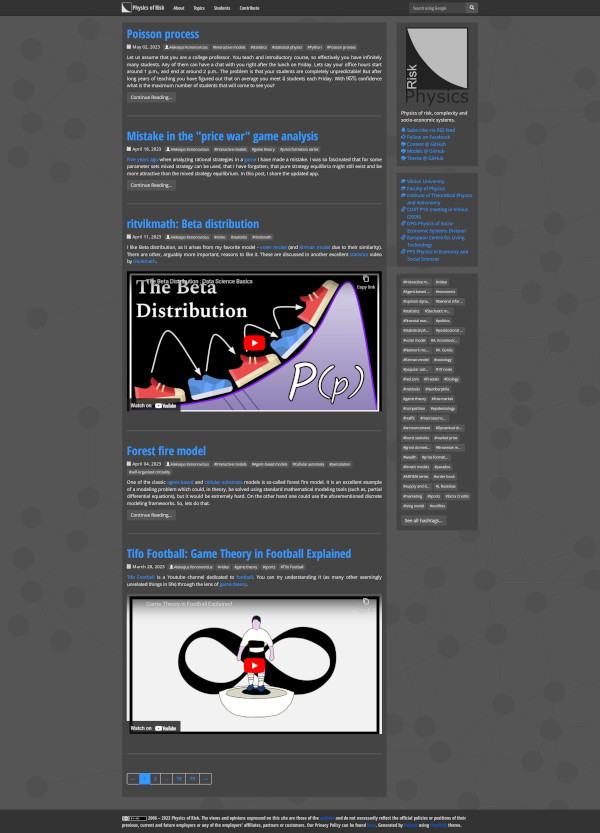

# PhysRisk

A Pelican theme created specially for the [Physics of Risk](http://rf.mokslasplius.lt/) website (hence the name for the theme). PhysRisk theme was created starting from [Plumage theme](https://github.com/kdeldycke/plumage) by Kevin Deldycke. Some fragments were directly "borrowed", while others were heavily rewritten.

Theme supports both light (default) and dark (visitor preference) modes.

